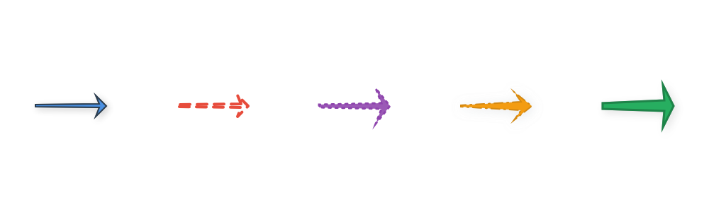
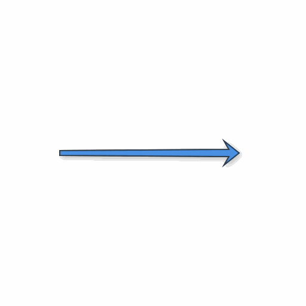
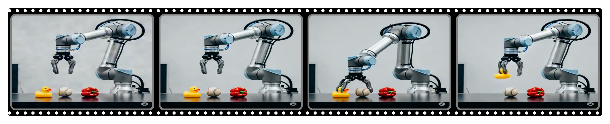
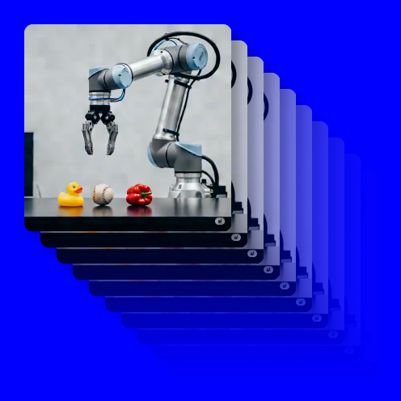
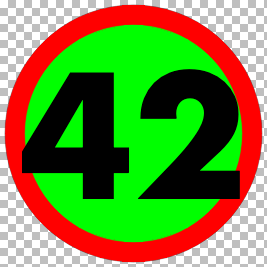

# FigureSnippets

Image and video processing utilities for creating visual effects.

## Arrow



## Arrow Animation



## Film Strip



## Image Stack



## Labeled Circle



## Usage

```python
from FigureSnippets import film_strip, labeled_circle, create_image_stack, skia_draw_arrow
```

Run interactive demos:
```bash
cd film_strip/ && marimo run film_strip_demo.py
cd labeled_circle/ && marimo run labeled_circle_demo.py
cd image_stack/ && marimo run image_stack_demo.py
cd arrow/ && marimo run arrow_demo.py
```